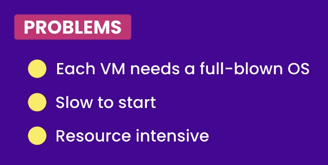
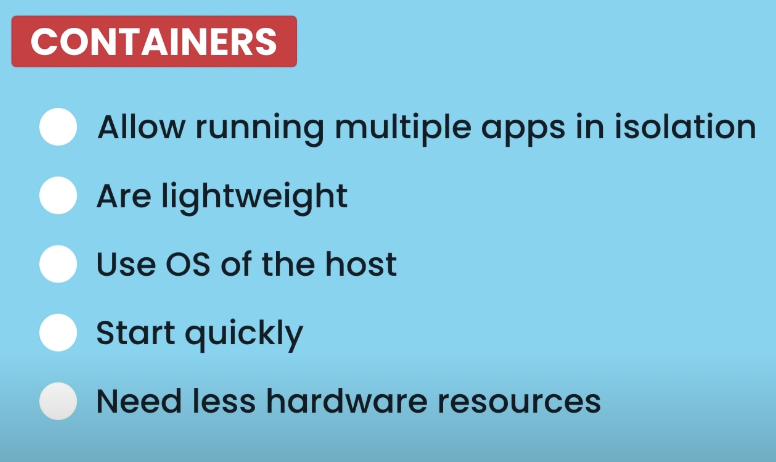

# Docker

Learn everything about Docker.

## Overview

- Build, run & ship applications.
- It helps in containerization.
- Since Docker Engine only runs on Linux kernel. That's why it supports linux OS. Developers using Windows and macOS for software development cannot run the engine until they spin up a virtual machine (VM) that runs linux.
- For macOS M1, one can use `colima` CLI to create a VM (aarch64-based).
- Docker images are actually combination of binary file + dependency files (optional) based on instruction in `Dockerfile` (used to generate the image). Using an image via `$ docker run ...` creates a new container with new id. You can find it via `$ docker ps` in running containers list. Now, that container would have the binary in the desired location as per `Dockerfile`. Like in rust-project, using cargo chef & eventually we use runtime to discard all the build cache (downloaded deps in `~/.cargo/.git/..`) & create the image. The build cache remains in the Docker Server machine. You can go to its (of docker server machine) file system to inspect. Also, you can clean build caches via `$ docker builder prune`. And then check via `$ docker system df`. 
- In Docker, each instruction in your Dockerfile creates a new layer in the image. When you use multi-stage builds to optimize your Rust application, you typically have a build stage where dependencies are downloaded and the application is compiled, followed by a final stage that contains only the compiled binary and necessary runtime components. This approach helps reduce the final image size by excluding unnecessary files, such as the .cargo directory, from the runtime environment.
- In the build stage, the `.cargo` directory is created and populated with downloaded dependencies during the build process. However, in the final stage, only the compiled binary is copied over, leaving behind the `.cargo` directory and other build artifacts. As a result, when you inspect the filesystem of the running container, you won’t find the `.cargo` directory because it was intentionally left out to keep the image lean. This method is commonly used to create smaller and more secure Docker images for Rust applications. By including only the necessary runtime components, you minimize the attack surface and resource usage of your containerized application. Watch thi [video](https://www.youtube.com/watch?v=xuqolj01D7M) for a practical demo.
- In most of the clouds, they support x86_64/amd64 architecture. That means your docker image must be created for those machines. Hence, need to use emulator tools like UTM where using Alpine linux (or similar tiny linux OS) can be used in CLI format to create docker image, which can be pushed to a registry like docker-hub. And then in the cloud, pull the image from container registry. And then cloud can host the container running that image.
- In the context of Docker containers, the attack surface refers to all the points where an unauthorized user could try to enter or extract data from the system. Minimizing the attack surface involves reducing these points of entry to enhance security.

   By excluding unnecessary files and directories, such as the `.cargo` folder containing Rust dependencies, from your final Docker image, you achieve several security benefits:
	1.	Reduced Vulnerabilities: Each additional file or package in your container can introduce potential vulnerabilities. By including only what’s necessary for your application to run, you limit the avenues through which an attacker might exploit your system. 
	2.	Enhanced Isolation: Unnecessary files can sometimes be misused to gain insights into your application’s structure or behavior. Removing them ensures that the runtime environment exposes only what’s essential, adhering to the principle of least privilege. 
	3.	Improved Compliance: Many security standards advocate for minimizing the software footprint to reduce potential risks. By stripping down your Docker image to its essentials, you align with these best practices, leading to a more secure deployment.

   In summary, by carefully curating the contents of your Docker image and excluding non-essential components like the `.cargo` directory, you effectively reduce the attack surface, leading to a more secure and efficient containerized application.
- Options for running Docker on macOS M1:
  - GUI
    - **Docker Desktop for Mac M1**: Used to run the engine on macOS. It is a native macOS application that you install on your computer. It creates a lightweight VM that runs Linux and then deploys the Docker Engine to that VM.
    - Rancher Desktop ❌ crashes on mac M1.
  - CLI:
    - `docker`: create & manage containers, images
    - `docker-compose`: run multi-container applications. Requires a YAML file to define the application services to run all at once, which otherwise would take multiple `docker run` commands.
    - `docker-completion`: auto-completion for docker commands.
    - ❌ `docker-machine`: create & manage VMs running Docker Engine. Not required if using Docker Desktop for Mac.
  > So, mainly there are 2 CLI commands to run docker. One is `docker` and another is `docker-compose`.

## Legend

```bash
❯: mac
$: linux VM
```

> On macOS M1

## A. Docker Desktop + Docker CLI

### Install

1. Download & install GUI i.e. [Docker Desktop for Mac M1](https://docs.docker.com/docker-for-mac/install/).
2. `docker` CLI:
   - install via `$ brew install docker`
   - upgrade via `$ brew upgrade docker`

3. `docker-compose` CLI:
   - install via `$ brew install docker-compose`
   - upgrade via `$ brew upgrade docker-compose`

### Usage

#### Commands

> After having run Docker Desktop for Mac M1, you can use `docker` CLI commands. You can see like this on the app:


- `❯ docker version` - To see the version of docker installed & client, server versions.
- `❯ docker run hello-world` - To run a docker image. If the image is not available locally, it will be pulled from docker hub.
- `❯ docker image ls` - To see the list of images.
- `❯ docker image push <dockerhub_image_name:tag_name>` - To push the image to docker hub.

And many more commands are [here](#commands) & also in Docs.

If the docker daemon is not running i.e. the docker engine is not running, then you will see this error:

```sh
❯ docker version
Client: Docker Engine - Community
 Version:           24.0.5
 API version:       1.43
 Go version:        go1.20.6
 Git commit:        ced0996600
 Built:             Wed Jul 19 19:44:22 2023
 OS/Arch:           darwin/arm64
 Context:           default
Cannot connect to the Docker daemon at unix:///var/run/docker.sock. Is the docker daemon running?
```

Congrats! You have successfully installed Docker Desktop on your Mac M1 & are able to use docker CLI.

## B. `colima` [RECOMMENDED]

> built on top of `lima`. So, `lima` is dropped. Hereafter we use `colima`.

Refer [this](https://github.com/abhi3700/my_coding_toolkit/blob/main/vm_all.md#use-docker-inside-vm-of-colima-like-this).

**Docker login**:

```console
abhi3700@colima:/$ sudo docker login
Login with your Docker ID to push and pull images from Docker Hub. If you don't have a Docker ID, head over to https://hub.docker.com to create one.
Username: abhi3700
Password:
WARNING! Your password will be stored unencrypted in /root/.docker/config.json.
Configure a credential helper to remove this warning. See
https://docs.docker.com/engine/reference/commandline/login/#credentials-store

Login Succeeded
```

Re-login

```console
abhi3700@lima-default:/Users/abhi3700/F/coding/github_repos/My_Learning_DevOps/docker/hello-docker
$ sudo docker login
Authenticating with existing credentials...
WARNING! Your password will be stored unencrypted in /root/.docker/config.json.
Configure a credential helper to remove this warning. See
https://docs.docker.com/engine/reference/commandline/login/#credentials-store

Login Succeeded
```

## Getting started

Prefer to do this inside Lima/Colima linux VM on mac M1.

1. Create a project `hello-docker` directory via `$ mkdir hello-docker`
2. Add a file `app.js` inside `hello-docker` directory. Add the following code:

   ```js
   console.log("Hello Docker!");
   ```

3. Add a `Dockerfile` file inside `hello-docker` directory taking reference from this [YT video](https://www.youtube.com/watch?v=pTFZFxd4hOI).

   ```dockerfile
   FROM node:alpine
   COPY . /app
   WORKDIR /app
   CMD node app.js
   ```

4. Build the docker image via `$ docker build -t hello-docker .` inside lima linux VM terminal.
5. Check images via `$ docker images ls`. The image with latest

```console
abhi3700@lima-default:/Users/abhi3700/F/coding/github_repos/My_Learning_DevOps/docker/hello-docker$
$ sudo docker image ls
REPOSITORY     TAG       IMAGE ID       CREATED         SIZE
hello-docker   latest    dbbcb40a83b7   5 minutes ago   167MB
node           alpine    9bcdf8fa2b21   2 days ago      167MB
```

Hence, we can see that the image `hello-docker` is created.

All the images are stored in this location: `unix:///var/run/docker.sock: Get "http://%2Fvar%2Frun%2Fdocker.sock/v1.24/containers/json"`. Nothing is present in the repo.

6. First spin-up a linux VM via `$ colima start`.
7. Run the docker image via `$ docker run hello-docker` inside lima linux VM terminal.

```console
abhi3700@lima-default:/Users/abhi3700/F/coding/github_repos/My_Learning_DevOps/docker/hello-docker
$ sudo docker run hello-docker
Hello Docker!
```

7. Login using docker hub credentials via `$ sudo docker login` inside lima linux VM terminal.

8. Tag the docker image via `$ docker tag dbbcb40a83b7 abhi3700/hello-docker:latest` inside lima linux VM terminal. And then the image list would be like this:

```sh
$ docker image ls
REPOSITORY              TAG            IMAGE ID       CREATED      SIZE
abhi3700/hello-docker   latest   dbbcb40a83b7   3 days ago   167MB
hello-docker            latest         dbbcb40a83b7   3 days ago   167MB
node                    alpine         9bcdf8fa2b21   5 days ago   167MB -->
```

9. Now, create a repository in the name of `hello-docker` in docker hub under username/account: `abhi3700`. Hence, the host would be [`docker.io/abhi3700/hello-docker`](https://hub.docker.com/r/abhi3700/hello-docker).
10. Publish the docker image to docker hub via `$ docker image push abhi3700/hello-docker:latest` inside lima linux VM terminal.

```console
The push refers to repository [docker.io/abhi3700/hello-docker]
c61658740dfd: Pushed
d0f090d9a0c6: Mounted from library/node
8678965b03c8: Mounted from library/node
7c50737eaab2: Mounted from library/node
5d3e392a13a0: Mounted from library/node
hello-docker: digest: sha256:7929aa35b2234697d88c7aa01ceef3d2cd8cf6d7a4579aaa76bd8f03afd5e5b0 size: 1365
```

11. In the docker hub, the image would be published & it looks like this:
    
12. Pull the docker image from docker hub via `$ docker pull abhi3700/hello-docker` inside any other linux VM terminal using [this](https://labs.play-with-docker.com/).

13. Now, the VM doesn't have node. So, just run the docker image via `$ docker run abhi3700/hello-docker`. So, you don't need any further tool installation or something but docker.

> In order to see a container running in the background, use `$ docker ps` command. And list of all the containers, use `$ docker ps -a`.

14. If you want to access the terminal of the running container, use `$ docker run -it <container_id> /bin/bash`.

```sh
abhi3700@colima:/Users/abhi3700/F/coding/github_repos/omnipay/omnipay/crates$ docker run --rm -it op-api-service /bin/bashroot@a646cc7a6703:/# ls
bin  boot  dev  etc  home  lib  media  mnt  opt  proc  root  run  sbin  srv  sys  tmp  usr  var
root@a646cc7a6703:/# /usr/src/app
bash: /usr/src/app: No such file or directory
root@a646cc7a6703:/# openssl s_client -tls1_2 -connect ac-xdtjxkm-shard-00-00.xrlfvc5.mongodb.net:27017 -servername ac-xdtjxkm-shard-00-00.xrlfvc5.mongodb.net
CONNECTED(00000003)
depth=1 C = US, O = Let's Encrypt, CN = R11
```

And if you want to access the terminal of the running container, use `$ docker exec -it <container_id>`.

## Concepts


---

Running VMs on a physical hardware using Hypervisor.


---

We can run different machines (for testing a software with different versions) on a single physical hardware like this:


---

Problems with VMs:


If a hardware has 8 GB RAM, then it has to be distributed into multiple VMs.

---

Benefit with Containers:



So, here in container we don't have to give a slice of hardware to each container. We can run 100s of containers on a single hardware, unlike VM where each takes a slice of hardware resources like RAM, CPU.

Technically a container is just a process running on a host machine.

---

Like in case of all hosts, we have a kernel, and all the containers share the kernel of the host machine.


> So, a linux container share linux kernel & a windows container share windows kernel.

> Now, a linux container can be run on a windows host machine, but a windows container can't be run on a linux host machine as linux machine doesn't have windows kernel and windows machine does have a linux kernel as WSL/WSL2.

But, in case of Mac, we don't have a linux kernel support. Hence, we have to use a linux VM to run linux containers. And Docker for Mac uses a lightweight linux VM like [Lima](https://github.com/lima-vm/lima) to run linux containers.


---

**DockerHub** is a registry of docker images. One can pull images from dockerhub and run them on their local machine.

---

**Docker Engine**

The core technology behind Docker. It is an open source software that runs on linux as a daemon that makes it possible to run containers on top of Linux kernel. It is responsible for the container lifecycle and isolation of physical resources (compute, memory, storage) that containers can access. The engine can run on a physical or a virtual machine, but it can only run on top of a Linux kernel i.e. any OS that is flavour of Linux. This is important to understand. Docker engine only runs on Linux.

---

**Run Ubuntu container**

```console
abhi3700@lima-default:/Users/abhi3700/F/coding/github_repos/My_Learning_DevOps$ docker run ubuntu
Unable to find image 'ubuntu:latest' locally
latest: Pulling from library/ubuntu
d6cb415e2683: Pull complete
Digest: sha256:4e5ff048c043848e77a7d4f4dce56c9f5c2c138548df2e2a4631c6769b1a5e52
Status: Downloaded newer image for ubuntu:latest
```

> Here, `docker run ubuntu` command will pull the ubuntu image (if not available) from docker hub and run it.

Run Ubuntu container in interactive mode:

```console
abhi3700@lima-default:/Users/abhi3700/F/coding/github_repos/My_Learning_DevOps$ docker run -it ubuntu
root@31a9ad4aba1d:/#
```

> Here, `-it` flag is used to run the container in interactive mode. And `root@31a9ad4aba1d:/#` is the prompt of the container. Now, it's in the root directory of the container with admin previlege i.e. why we can see `#` symbol, otherwise we would see `$` symbol.

## Commands

### Image

- `$ docker image ls` - To see the list of images.
- `$ docker image push <dockerhub_image_name:tag_name>` - To push the image to docker hub.
- `$ docker image rm <dockerhub_image_name:tag_name>abhi3700/hello-docker:hello-docker` - To remove the image from local machine.

Example:

```sh
docker image rm abhi3700/hello-docker:hello-docker
```
- `docker rmi <image_id>` - To remove the image from local machine.

### Build

- `docker build -t <image_name> .` - To build the image from the Dockerfile.
- `docker build -t <image_name:tag_name> .` - To build the image from the Dockerfile.
- `docker buildx build --platform linux/arm64 -t <dockerhub_image_name>:<image_tag> .` - To build the image from the Dockerfile for different platform.
   Example:

```sh
docker buildx build --platform linux/arm64 -t abhi3700/hello-docker:latest .
```

### Pull/Push

- `docker pull <dockerhub_image_name:tag_name>` - To pull the image from docker hub.
- `docker push <dockerhub_image_name:tag_name>` - To push the image to docker hub.

### Run

- `docker run hello-world` - To run a docker image. If the image is not available locally, it will be pulled from docker hub.
- `docker run --env-file .env hello-api`: To run a docker image locally using env variables. 
   > Run it locally only, as in production, making `.env` available in the same file system has security risk.
   > Also, the secrets are not baked into the image.
  - In production environment, use the cloud's native secret management. Options:
    - Docker secrets manager [Use secrets via docker compose](https://docs.docker.com/compose/how-tos/use-secrets/).
      - If you’re using Docker Compose, you can specify the .env file in the docker-compose.yml file:
      ```yaml
      version: '3.8'
      services:
      app:
         image: hello-api
         env_file:
            - .env
      ```
      Then run `$ docker-compose up`.
    - railway docker image.
    - Koyeb
    - ..
- `docker run --env-file .env -p [3001:8000] hello-api`: This command runs your container and maps port 8000 inside the container to port 3001 on your host machine.
  - Verify it's running:
  ```sh
  curl http://localhost:3001
  ```
  Verify if envs are passed properly to the container by inspecting them:
  ```sh
  docker exec -it <container_id> env
  ```
  > **Do not commit the .env file to version control.**

- `docker run -it <image_name>` - To run the image.
- `docker run --rm -it <image_name>` - To run the image and remove the container after it is stopped.
- `docker run -it <container_id> /bin/bash` - To access the terminal of the running container. This is useful to run commands inside the container. Suppose you have forgotten to set the ENVs in the Dockerfile, then you can set them using this command and then run the CMD command inside the container.
- `docker run -d <image_name>` - To run the image in detached mode. Detached mode means that the container will run in the background and you will not be able to see the output of the container. To see the output of the container, you can use `docker logs <container_id>`.
- `docker run -d -p <host_port>:<container_port> <image_name>` - To run the image and map the port of the container to the port of the host machine. And `-d` flag is used to run the container in detached mode. Here, `-p` is for publishing the [`host_port`:`container_port`].

> NOTE: `-d` flag is opposite of `-it` flag. The former means detached mode and the latter means interactive mode. The former is used to run the container in the background and the latter is used to run the container in the foreground.

### Container

When an built image is run, it creates a container.

- `docker ps` - To see the running containers.
- `docker ps -a` - To see all the containers available for execution.
- `docker rm <container_id>` - To remove the container from local machine.
- `docker rm -f <container_id>` - To forcefully remove the container from local machine.
- `docker stop <container_id>` - To stop the running container.
- `docker start <container_id>` - To start the stopped container. Although simply returns the container_id, but still starts the container. You can verify with `docker ps`.
   > In this case, no initialization done (e.g. for API service like DB init...).
- `docker restart <container_id>` - To restart the running/stopped container. Stops and starts the container, regardless of its current state. It's equivalent to `docker stop ..` && `docker start ..` commands run in sequence.
   > In this case, code is run from the beginning like from start of the `main()` fn.
- `docker kill <container_id>` - To kill the running container.
- `docker inspect <container_id>` - To see the details of the container like:
  - env vars set.
  - host, port
  - ..
- `docker inspect -f '{{range .NetworkSettings.Networks}}{{.IPAddress}}{{end}}' <container_id>` - To see the IP address of the container.
   Usage: to run `curl` command from host machine to make API call to the running container (where the server is running).

<details><summary>Sample output:</summary>

```sh
docker inspect 37b6ab6ef78e
[
    {
        "Id": "37b6ab6ef78eed51f1bed6b2f759186171927ac9ce7eb2b09e5664358403f510",
        "Created": "2025-01-23T16:56:53.24934793Z",
        "Path": "/usr/local/bin/op-api-service",
        "Args": [],
        "State": {
            "Status": "running",
            "Running": true,
            "Paused": false,
            "Restarting": false,
            "OOMKilled": false,
            "Dead": false,
            "Pid": 58030,
            "ExitCode": 0,
            "Error": "",
            "StartedAt": "2025-01-23T16:56:53.296584036Z",
            "FinishedAt": "0001-01-01T00:00:00Z"
        },
        "Image": "sha256:9a19235651892798ffc244b4ab45819cb68428b1560558c2ec1d9314b8ee5c00",
        "ResolvConfPath": "/var/lib/docker/containers/37b6ab6ef78eed51f1bed6b2f759186171927ac9ce7eb2b09e5664358403f510/resolv.conf",
      ...
      ...
      ...
    }
]
```

</details>

### Exec

- `docker exec -it <container_id> <command>` - To execute the command inside the running container.
- `docker exec -it <container_id> env` - To inspect the envs set inside running container.
- `docker exec -it <container_id> bash` - Get inside the container. This is useful to see the file contents of my docker App (inside `/app`). <kbd>ctrl+d</kbd> to logout.

### Logs

- `docker logs <container_id>` - To see the logs of the running container. Here, it shows the logs of the container and then exits.
- `docker logs -f <container_id>` - To see the logs of the running container in real-time. Here, it shows the logs of the container and then continues to show the logs in real-time.

### Daemon storage (Disk, ..)

Usage: It can happen that when building multiple times (especially in Rust build), it can take away all the space. So, leads to error: `No space left on device` 😞.

- `docker info`: Get daemon info.
- `docker system df`: Disk usage.
- `docker image prune -a`: Delete old Docker images.
- `docker container prune`: Remove dangling containers.
- `docker network prune`: Remove unused Docker networks.
- `docker volumes prune`: Clean up volumes.
- `docker builder prune`: Free up build cache.
- `docker builder prune --all`: remove all unused build cache layers. If you want to ensure no cache layers remain, use the `--all` flag.

## References

- [Docker documentation](https://docs.docker.com/)
- [Docker Tutorial for Beginners | Programming with Mosh](https://www.youtube.com/watch?v=pTFZFxd4hOI)
