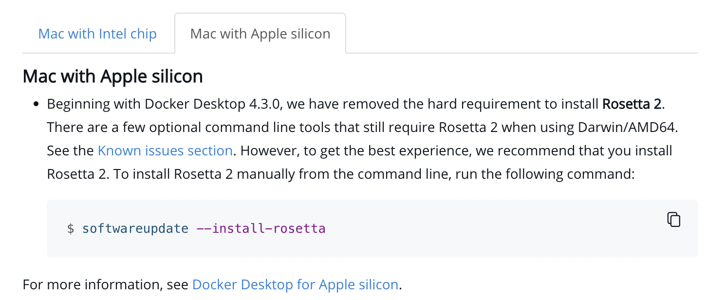
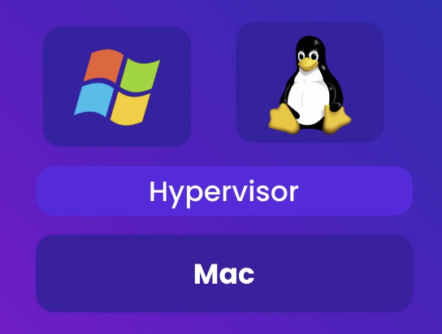
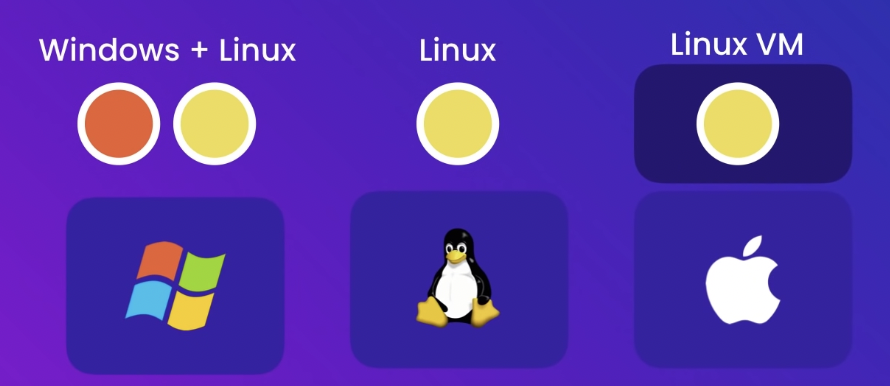

# Docker

Learn everything about Docker.

## About

- Build, run & ship applications.
- It helps in containerization

## Legend

```bash
❯: mac
$: linux VM
```

## Installation

### macOS

#### Directly on Host machine

**docker**

- `❯ brew install docker`
  > if exists, update using `$ brew upgrade docker`

---

**docker-machine**

- `❯ brew install docker-machine`
  > if exists, update using `$ brew upgrade docker-machine`

> `brew` on macOS is like `apt` on Ubuntu.

---

> On macOS the docker binary is only a client and you cannot use it to run the docker daemon, because Docker daemon uses Linux-specific kernel features, therefore you can’t run Docker natively in OS X. So you have to install docker-machine in order to create VM and attach to it.

`docker-machine` relies on VirtualBox being installed and will fail if this isn't the case.

---

**Install VirtualBox**

```console
❯ brew install virtualbox
==> Downloading https://download.virtualbox.org/virtualbox/7.0.2/VirtualBox-7.0.
Already downloaded: /Users/abhi3700/Library/Caches/Homebrew/downloads/208eb45ad7f80d3564e4de7d8bd64eefbf72aef4ea004f68957f55341724bb0e--VirtualBox-7.0.2-154219-OSX.dmg
Error: Cask virtualbox depends on hardware architecture being one of [{:type=>:intel, :bits=>64}], but you are running {:type=>:arm, :bits=>64}.
```

And then shift to intel, x64 architecture by setting up Rosetta. So, just use the command `$ intel` in the terminal to switch to intel arch.

[Reference](https://docs.docker.com/desktop/install/mac-install/)


```console
❯ intel
❯ arch
i386
```

Retry:

```console
❯ brew install virtualbox
==> Downloading https://download.virtualbox.org/virtualbox/7.0.2/VirtualBox-7.0.
Already downloaded: /Users/abhi3700/Library/Caches/Homebrew/downloads/208eb45ad7f80d3564e4de7d8bd64eefbf72aef4ea004f68957f55341724bb0e--VirtualBox-7.0.2-154219-OSX.dmg
==> Installing Cask virtualbox
==> Running installer for virtualbox; your password may be necessary.
Package installers may write to any location; options such as `--appdir` are ignored.
Password:
installer: Package name is Oracle VM VirtualBox
installer: choices changes file '/private/tmp/choices20221021-14368-qumemc.xml' applied
installer: Installing at base path /
installer: The install was successful.
==> Changing ownership of paths required by virtualbox; your password may be nec
🍺  virtualbox was successfully installed!
```

```console
❯ docker-machine create --driver virtualbox default
Creating CA: /Users/abhi3700/.docker/machine/certs/ca.pem
Creating client certificate: /Users/abhi3700/.docker/machine/certs/cert.pem
Running pre-create checks...
Error with pre-create check: "This computer doesn't have VT-X/AMD-v enabled. Enabling it in the BIOS is mandatory"
```

Check if docker supports virtualization:

```console
❯ sysctl kern.hv_support
kern.hv_support: 1
```

> This implies it supports virtualization, but need to be enabled in the BIOS.

TODO: How to enable virtualization in BIOS on Mac M1?

Once done, just follow the 2 steps from the [stack overflow reference](https://stackoverflow.com/a/49719638/6774636)

---

**Confirm docker is running**

- `$ docker version`
  > It should show the version of docker installed & client, server versions.

#### On Linux VM

Switch to Linux VM

I am using Lima for this.

```console
❯ limactl start default
❯ lima
```

More related to [Lima](https://github.com/abhi3700/my_coding_toolkit/blob/main/vm_all.md#lima--install-ubuntu-arm-on-mac-arm).

---

**Install docker**

```console
$ sudo apt install docker.io
```

---

**Confirm docker is running**

- `$ sudo docker version`
  > It should show the version of docker installed & client, server versions.

## Getting started

Prefer to do this inside Lima linux VM.

1. Create a project `hello-docker` directory via `$ mkdir hello-docker`
2. Add a file `app.js` inside `hello-docker` directory. Add the following code:

   ```js
   console.log("Hello Docker!");
   ```

3. Add a `Dockerfile` file inside `hello-docker` directory taking reference from this [YT video](https://www.youtube.com/watch?v=pTFZFxd4hOI).

   ```dockerfile
   FROM node:alpine
   COPY . /app
   WORKDIR /app
   CMD node app.js
   ```

4. Build the docker image via `$ docker build -t hello-docker .` inside lima linux VM terminal.
5. Check images via `$ docker images ls`

```console
abhi3700@lima-default:/Users/abhi3700/F/coding/github_repos/My_Learning_DevOps/docker/hello-docker$
$ sudo docker image ls
REPOSITORY     TAG       IMAGE ID       CREATED         SIZE
hello-docker   latest    dbbcb40a83b7   5 minutes ago   167MB
node           alpine    9bcdf8fa2b21   2 days ago      167MB
```

Hence, we can see that the image `hello-docker` is created.

## Concepts


---

Running VMs on a physical hardware using Hypervisor.



---

We can run different machines (for testing a software with different versions) on a single physical hardware like this:


---

Problems with VMs:


If a hardware has 8 GB RAM, then it has to be distributed into multiple VMs.

---

Benefit with Containers:


So, here in container we don't have to give a slice of hardware to each container. We can run 100s of containers on a single hardware, unlike VM where each takes a slice of hardware resources like RAM, CPU.

Technically a container is just a process running on a host machine.

---

Like in case of all hosts, we have a kernel, and all the containers share the kernel of the host machine.


> So, a linux container share linux kernel & a windows container share windows kernel.

> Now, a linux container can be run on a windows host machine, but a windows container can't be run on a linux host machine as linux machine doesn't have windows kernel and windows machine does have a linux kernel as WSL/WSL2.

But, in case of Mac, we don't have a linux kernel support. Hence, we have to use a linux VM to run linux containers. And Docker for Mac uses a lightweight linux VM like [Lima](https://github.com/lima-vm/lima) to run linux containers.


---

**DockerHub** is a registry of docker images. One can pull images from dockerhub and run them on their local machine.

## References

- [Docker Tutorial for Beginners | Programming with Mosh](https://www.youtube.com/watch?v=pTFZFxd4hOI)
